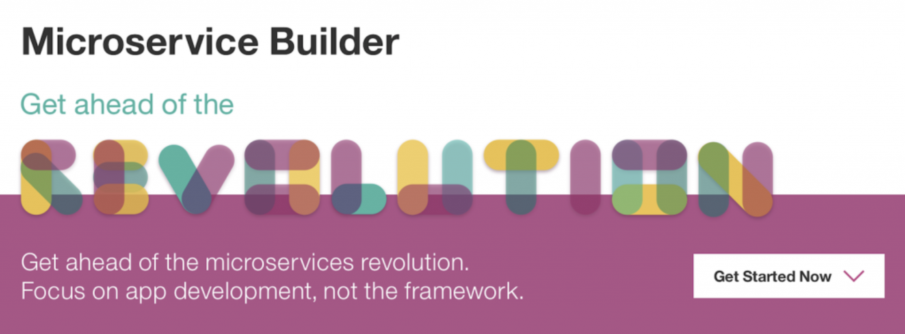
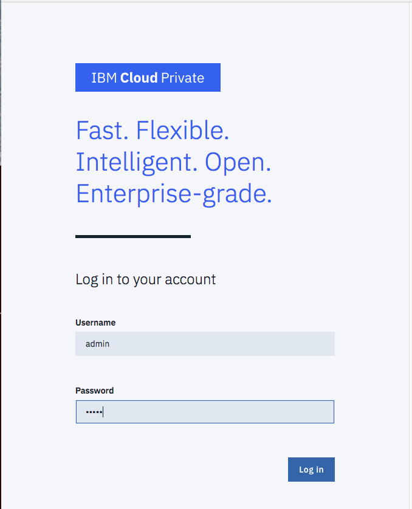

<div style="background-color:black;color:white; vertical-align: middle; text-align:center;font-size:250%; padding:10px; margin-top:100px"><b>
IBM Cloud Private - Microservice Builder Lab
 </b></a></div>

---




# Cloud-Native Microservice Builder Lab

In this tutorial, you create, install and run a cloud-native microservice application on an IBM® Cloud Private platform on Kubernetes. 

Microservice Builder will guide you thru the tree creation of complete project including all the directories, the manifest files, the monitoring option that you need for a perfect application.

**Table of Contents**

---

[[toc]]

---
 


# Task 1: Access the IBM Cloud Private console


From a machine that is hosting your environment, open a web browser and go to one of the following URLs to access the IBM Cloud Private management console:
  - Open a browser
  - go to https://192.168.225.132:8443 or type another IP@ given by your instructor
  - Login to ICP console with admin / admin



On the terminal, connect on the Ubuntu VM using SSH or Putty.

Check the the bx dev command is working:

`bx dev`

**Results**
```console
root:[abraca]: bx dev
NAME:
   bx dev - A CLI plugin to create, manage, and run projects on IBM Cloud

USAGE:
   bx dev command [arguments...] [command options]

VERSION:
   1.2.1

COMMANDS:
   build             Build the project in a local container
   code              Download the code from a project
   console           Opens the IBM Cloud console for a project
   create            Creates a new project and gives you the option to add services
   debug             Debug your application in a local container
   delete            Deletes a project from your space
   deploy            Deploy an application to IBM Cloud
   enable            Add IBM Cloud files to an existing project.
   get-credentials   Gets credentials required by the project to enable use of bound services.
   list              List all IBM Cloud projects in a space
   run               Run your application in a local container
   shell             Open a shell into a local container
   status            Check the status of the containers used by the CLI
   stop              Stop a container
   test              Test your application in a local container
   view              View the URL of your project
   help              Show help
```

If this command doesn't show that screen, then go to the end of the ICP Installation Lab and install that command. 


# Task 2: Use the Microservice Builder


Application workloads can be deployed to run on an IBM Cloud Private cluster. The deployment of an application workload must be made available as a Helm package. Such packages must either be made available for deployment on a Helm repository, or loaded into an IBM Cloud Private internal Helm repository.

## 1. Create your project 

`bx dev create`

Follow the instructions:

Log in to IBM Cloud using the bx login command to synchronize your projects with the IBM Cloud dashboard, and to enable the use of IBM Cloud services in your project. 
? Do you wish to continue without logging in? [y/n]> **y**
? Select a resource type:                  
1. Backend Service / Web App
2. Mobile Client
Enter a number> **1**

? Select a language:
1. Java - MicroProfile / Java EE
2. Java - Spring
3. Node
4. Python - Django
5. Python - Flask
6. Swift
Enter a number> **3**

? Select a Starter Kit or select the last option for more information:
1. Backend for Frontend - Express.js Backend
2. Microservice - Express.js Microservice
3. Web App - Express.js Basic
4. Web App - Express.js React
5. Web App - MongoDb + Express + Angular + Node
6. Web App - MongoDb + Express + React + Node
7. Show more details
Enter a number> **3**


? Enter a name for your project> **abraca**     
                                  
The project, abraca, has been successfully saved into the current directory.

Visualize your project. You can notice that every thing has been created for you.

```console
root:[~]: ls abraca/
chart           Dockerfile        Jenkinsfile  manifest.yml  public     run-debug  server
cli-config.yml  Dockerfile-tools  LICENSE      package.json  README.md  run-dev    test
root:[~]: 
```
## 2. Build your project

`cd abraca`

`bx dev build`

**Results**
```console
root:[~]: cd abraca/
root:[abraca]: bx dev build
Creating image abraca-express-tools based on Dockerfile-tools...
OK                    
Creating a container named 'abraca-express-tools' from that image...
OK
Starting the 'abraca-express-tools' container...
OK
Building the project in the current directory started at Tue Apr 17 21:34:16 2018
OK                    
Stopping the 'abraca-express-tools' container...
OK
```

A new container (abraca-express-tools) has been created for you.

```console
root:[abraca]: docker images abraca-express-tools
REPOSITORY             TAG                 IMAGE ID            CREATED             SIZE
abraca-express-tools   latest              e3072a821f87        3 minutes ago       483MB
```

## 3. Push the container

Before pushing, you must tab the container with the namspace and the proper information:

```console
 docker tag abraca-express-tools:latest mycluster.icp:8500/default/abraca:latest
```

**Results**
```console
root:[abraca]: docker images mycluster.icp:8500/default/abraca:latest
REPOSITORY                          TAG                 IMAGE ID            CREATED             SIZE
mycluster.icp:8500/default/abraca   latest              e3072a821f87        8 minutes ago       483MB
```

Then login to the container registry
`docker login mycluster.icp:8500`

**Results**
```console
root:[abraca]: docker login mycluster.icp:8500
Username (admin): admin
Password: 
Login Succeeded
```

# Task 3: Install the application

Use Helm command to install the new created application :

```console
helm install --name abraca --set image.repository=mycluster.icp:8500/default/abraca,image.tag=latest . --tls
```

**Results**
```console
LAST DEPLOYED: Tue Apr 17 21:51:29 2018
NAMESPACE: default
STATUS: DEPLOYED

RESOURCES:
==> v1/Service
NAME            TYPE      CLUSTER-IP  EXTERNAL-IP  PORT(S)         AGE
abraca-service  NodePort  10.0.0.236  <none>       3000:31621/TCP  0s

==> v1beta1/Deployment
NAME               DESIRED  CURRENT  UP-TO-DATE  AVAILABLE  AGE
abraca-deployment  1        1        1           0          0s

==> v1/Pod(related)
NAME                                READY  STATUS             RESTARTS  AGE
abraca-deployment-6b8cb9f6c4-qngt6  0/1    ContainerCreating  0         0s
```

List the corresponding service in kubernetes:

`kubectl describe service abraca-service``

**Results**
```console
root:[abraca]: kubectl describe service abraca-service
Name:                     abraca-service
Namespace:                default
Labels:                   chart=abraca-1.0.0
Annotations:              prometheus.io/scrape=true
Selector:                 app=abraca-selector
Type:                     NodePort
IP:                       10.0.0.236
Port:                     http  3000/TCP
TargetPort:               3000/TCP
NodePort:                 http  31621/TCP
Endpoints:                
Session Affinity:         None
External Traffic Policy:  Cluster
Events:                   <none>
```
Locate the NodePort : 31621.

Go the ICP management console and check the Helm Release and all the Kubernetes components. 

Try the URL : `http://mycluster.icp:31621`

# Congratulations 

You have successfully created and installed a microservice application with Microservice Builder.

> Note: you can delete the helm release with the following command :

`helm delete abraca --purge --tls`


----


<div style="background-color:black;color:white; vertical-align: middle; text-align:center;font-size:250%; padding:10px; margin-top:100px"><b>
IBM Cloud Private - Microservice Builder Lab
 </b></a></div>
